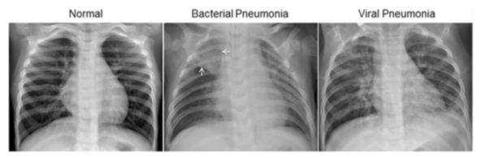
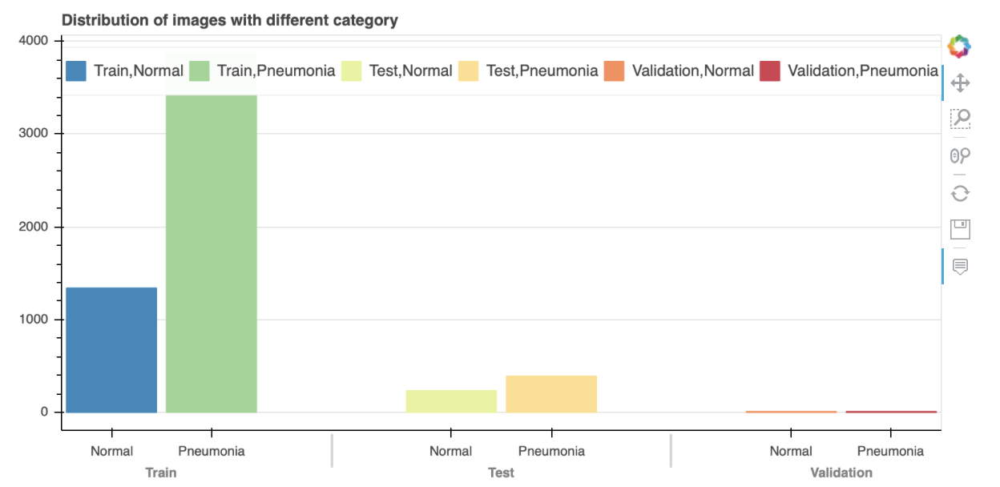
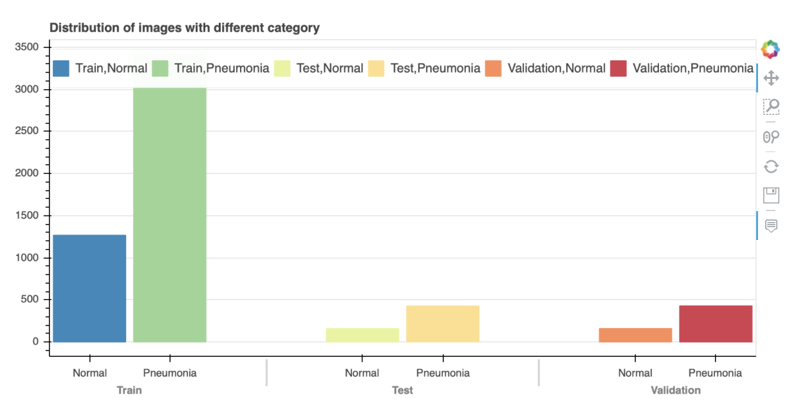
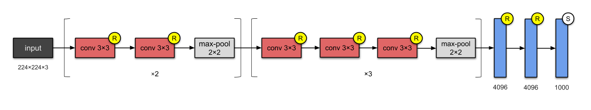

## Predicting Pneumonia: Addressing Mortality Rates in Developing Nations

### Data Sourcing Content

All data for this investigation was provided by the Guangzhou Women and Children’s Medical Center, Guangzhou. You can download this dataset at: https://www.kaggle.com/paultimothymooney/chest-xray-pneumonia

Furthermore, the dataset is organized into 3 folders (train, test, val) and contains subfolders for each image category (Pneumonia/Normal). There are 5,863 X-Ray images (JPEG) and 2 categories (Pneumonia/Normal).

Chest X-ray images (anterior-posterior) were selected from retrospective cohorts of pediatric patients of one to five years old from Guangzhou Women and Children’s Medical Center, Guangzhou. All chest X-ray imaging was performed as part of patients’ routine clinical care.

For the analysis of chest x-ray images, all chest radiographs were initially screened for quality control by removing all low quality or unreadable scans. The diagnoses for the images were then graded by two expert physicians before being cleared for training the AI system. In order to account for any grading errors, the evaluation set was also checked by a third expert. 

### Business Case

"A child dies of pneumonia every 39 seconds. Pneumonia kills more children than any other infectious disease, claiming the lives of over 800,000 children under five every year, or around 2,200 every day. This includes over 153,000 newborns." - (https://data.unicef.org/topic/child-health/pneumonia/). By the end of our presentation rough 7.69 children will die. 

Thus, our goal is to partner with countries worldwide to aid in their diagnosis of pneumonia in children so that healthcare professionals can prescribe treatment regiments, when timely and appropriate, accordingly. Therefore, the overall goal is to alleviate the amount of children worldwide, specifically in third-world countries, that suffer and ultimately die from pneumonia.

In order to achieve such a goal we would need to partner with both hospital and nonprofit organizations. Our partnership with hospital systems would include redistributing their "older" x-ray equipment to those in dire need. Moreover, our partnership with nonprofits would entail providing adequate resources such as WIFI hotspots and devices capable of taking pictures of x-rays. 

Finally, while this is a win/win scenario we must first create a CNN that is not only capable of classifying children with and without pneumonia from provided datasets, but from newly generated x-rays as well. 

### Data Cleaning/Visualization

Thankfully, this dataset is very clean however upon downloading the dataset from Kaggle it is immediately apparent that there is a significant imbalance within the test (234 Normal & 390 Pneumonia Images) and train folders (1583 Normal & 4273 Pneumonia Images). The validation set however was a 50/50 split at 8 Normal and 8 Pneumonia Images.

### Dealing With Class Imbalance

To address the class imbalance we decided to redistribute the Normal versus Pneumonia images within the train, test, and validation sets. After said distribution the test folder contained (158 Normal & 427 Pneumonia Images), train folder contained (1266 Normal & 3418 Pneumonia Images), and the validation folder contained (159 Normal and 428 Pneumonia Images).  

Thus, we felt this would reflect positively in our analysis going forward. However, to be clear our models did not include the redistributed images as the results were not on par with previous iterations. Thus, the following models used image augmentation to address the class imbalance.

### Base CNN Model

Layer (type)                 Output Shape              Param #   

conv2d_13 (Conv2D)           (None, 62, 62, 64)        1792      
max_pooling2d_5 (MaxPooling2 (None, 31, 31, 64)        0         
conv2d_14 (Conv2D)           (None, 29, 29, 32)        18464     
max_pooling2d_6 (MaxPooling2 (None, 14, 14, 32)        0         
flatten_1 (Flatten)          (None, 6272)              0         
dense_3 (Dense)              (None, 32)                200736    
dense_4 (Dense)              (None, 1)                 33        

Total params: 221,025
Trainable params: 221,025
Non-trainable params: 0

### VGG16 CNN Model

https://towardsdatascience.com/illustrated-10-cnn-architectures-95d78ace614d

### Conclusion

Saving children from pneumonia requires urgent action and recognizing danger signs. Thus providing diagnostic tools that can accurately diagnosis pneumonia is crucial.

Our best model (Base Model) had a accuracy score after 500 epochs of 91% and a recall score of 0.9872 (recall is the important metric here because we want to avoid False Negatives). However, the model is NOT robust enough given the high amount of False Negatives (169).

Our Transfer had an accuracy score after 10 epochs of 91% and a recall score of 0.9615. This model shows promise, in that it was better with predictions, however, many more epochs will need to be run in order to determine efficacy and potential for deployment.

### Future Work

* Partner with healthcare organizations, clinics, and private healthcare professionals that have x-rays of children with and without pneumonia.
* Expand our dataset to include x-rays of patients of all ages, not just children 1-5 years old.
* Utilize different CNN models (i.e. LeNet-5, AlexNet, Inception-v1, Inception-v3, ResNet-50, Xception, Inception-v4, Inception-ResNets, ResNeXt-50).
* Allow our models to run for 500+ epochs, particularly the transfer learning and established architecture models.
* Utilize GPU's/Cloud computing to analyze results quicker and more efficiently.
